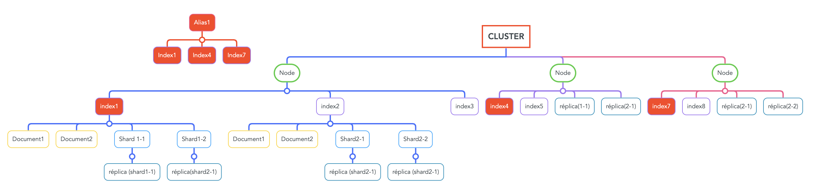
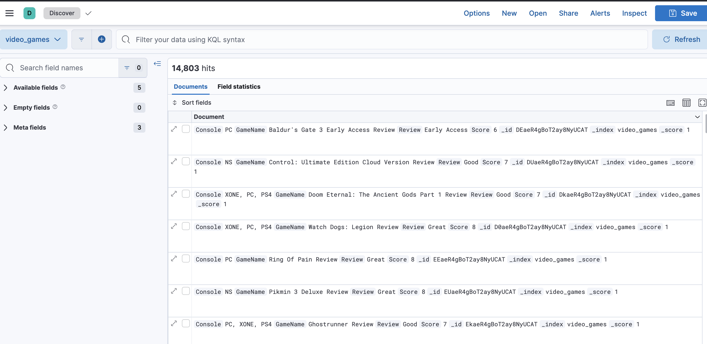
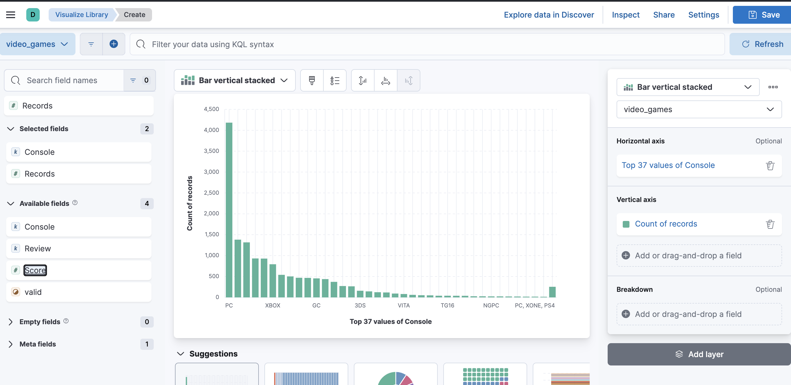
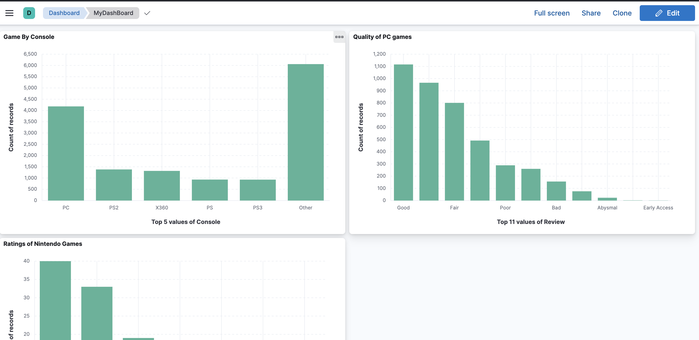

## SEMAINE ELASTICSEARCH

- Etapes pour installer localement Elastic Search: 
    - On récupère l'image Docker de la dernière version stable de ElasticSearch : `docker pull docker.elastic.co/elasticsearch/elasticsearch:8.7.1`
    - On crée un nouveau Docker network avec : `docker network create elastic`
    - On copie le dossier de certificat de securité du container docker sur la machine (en local) avec : `docker cp es01:/usr/share/elasticsearch/config/certs/http_ca.crt .`
    - On run le container Docker avec : `docker run --name es01 --net elastic -p 9200:9200 -it docker.elastic.co/elasticsearch/elasticsearch:8.7.1`. En plus de run notre container, cette commande génère un mot de passe et un token.
    - On fait ensuite un requête http pour se connecter à notre cluster ElasticSearch avec : `curl --cacert http_ca.crt -u elastic https://localhost:9200`. On donne ensuite le mot de passe générer par la commande `docker run` à l'étape précédente. 
    Si la connexion ne se fait pas on reçoit une erreur, sinon, si on se connecte au cluster on reçoit une réponse json tel que celle-ci : 
    `{
  "name" : "ab0f6a460419",
  "cluster_name" : "docker-cluster",
  "cluster_uuid" : "a9LMlVd_R1CnczQMmmkcyg",
  "version" : {
    "number" : "8.7.1",
    "build_flavor" : "default",
    "build_type" : "docker",
    "build_hash" : "f229ed3f893a515d590d0f39b05f68913e2d9b53",
    "build_date" : "2023-04-27T04:33:42.127815583Z",
    "build_snapshot" : false,
    "lucene_version" : "9.5.0",
    "minimum_wire_compatibility_version" : "7.17.0",
    "minimum_index_compatibility_version" : "7.0.0"
  },
  "tagline" : "You Know, for Search"
}`

Après avoir installé ElasticSearch, on peut maintenant le lançer sur notre machine : 
    On lance un container ElasticSearch avec cette commande : `docker run --name elasticsearch --net elastic -p 9200:9200 -p 9300:9300 -e "discovery.type=single-node" -t docker.elastic.co/elasticsearch/elasticsearch:8.7.1`. Avec cette commande on récupère en sortie le token pour pour lier Kibana à ElasticSearch et le mot de passe pour s'y connecter. Le username par défaut "elastic" est aussi crée. 

On récupère ensuite l'image docker de kibana : `docker pull docker.elastic.co/kibana/kibana:8.7.1`
Et on lance le container : `docker run --name kibana --net elastic -p 5601:5601 docker.elastic.co/kibana/kibana:8.7.1`
Sur https://localhost:5601 on renseigne le token pour kibana et on peut ensuite se connecter avec le username : "elastic" et le mot de passe généré par l'execution du container ElasticSearch. 

Nous pouvons ensuite visualiser les données indexée dans ElasticSearch !

On se rend ensuite dans le dev_tools pour y créer un nouvel index avec : ``PUT /new-test-index``

On peut modifier son mapping avec la commande : 
``
PUT /new-test-index/_mapping
{
  "properties": {
    "field2": {
      "type": "boolean"
    }
  }
}
``

On peut indexer un document de cette manière : 
``
POST /new-test-index/_doc/
{
  "field1": "je suis un autre texte",
  "field2": false
}
``

Si on veut indexer beaucoup de document en une seule fois, il est préférebale de faire un bulk : 
``PUT _bulk
{"index":{"_index":"new-test-index"}}
{"field1":"bulk1","field2":true}
{"index":{"_index":"new-test-index"}}
{"field1":"bulk2","field2":false}
{"index":{"_index":"new-test-index"}}
{"field1":"bulk3","field2":true}
{"index":{"_index":"new-test-index"}}
{"field1":"bulk4","field2":false}
{"index":{"_index":"new-test-index"}}
{"field1":"bulk5","field2":true}
{"index":{"_index":"new-test-index"}}
{"field1":"bulk6","field2":false}``

On visualise ensuite notre mapping avec cette requête : ``GET /new-test-index/_mapping``

On visualise aussi nos document indexés avec cette requête : ``GET /new-test-index/_search``

### Mapping
  ElasticSearch possède deux manières de mapper ses indexs : 
    - il peut les mapper dynamiquement, en analysant les documents indexés et en déduisant le type des champs des documents indexés. 
      Il crée dynamiquement le mapping de l'indexe grâce à cette méthode. Cette méthode ne requiert aucune configuration
    - On peut aussi créer un mapping prédéfini pour l'index. En analysant les documents indexés ElasticSearch va repérer lequel correspondent au nom et au type configurer dans le mapping. Tout les documents pourront donc être visualisés suivant ce schéma. Ce type de mapping requiert une configuration. 

  Voilà comment on se présente un mapping : (**INSERER PHOTO**)

  Il est possible de modifier le mapping d'un index sans forcément le recréer complètement. Cependant suivant les modifications du mapping et les données indexés, il est possible que certains données soient réindexés dans un index de transition. 

## Tokenisation et Normalisation 
  La Tokenisation est un processus qui va découpé une chaine de caractères en plusieurs caracter ou petite chaines de caractères appelés token. Suivant l'analyzer utilisé, ces tokens peuvent être des mots, des caractères spéciaux ou des bouts de mots.

  La Normalisation est le comportement qui va être appliqué au Token. Il peuvent être divers et variés allant de la suppression de la ponctuation ou des accents jusqu'a mettre les tokens en majuscule ou en minuscule. 

## APIS 
  Lors de la présentation nous avons utilisés l'API "_search", "_doc", "_mapping". 

## Analyzer
  Les données indexés sont analysés par un analyser. Celui ci va Tokeniser les données indexés. L'Analyser standard va tokeniser les données suivant plusieurs token en fonction des espce entre les mots. 
  Par exemple : "Luffy sera le prochain roi des pirates" devient => ["Luffy" | "sera" | "le" | "prochain" | "roi" | "des" | "pirates"] (la phrase est donc tokeniser en 7 tokens).
  L'analyser Keyword, aurait permis de garder cette phrase en un seul token contenant la phrase entière. 

## Schéma d'ElasticSearch

Explication : 
  - En haut du schéma, avec les bordures rouges, se trouve le cluster, un ensemble de plusieurs nodes
  - les nodes (noeuds) sont des instances d'Elasticsearch qui forme le cluster. 
  - Dans les nodes, on peut trouver des index qui sont l'équivalent des tables dans les bases de données SQL. C'est dans les index que l'on va indexer les documents.
  - Les documents sont les données, qui sont indexées suivant le mapping de l'index.
  - Les shards sont des partitions d'un index. Ils se partagent la données de l'index. Si un index possède 3 shards. Chacun des shards possèdera 1/3 de la donnée indexée dans l'index. Ils permettent de répartir la données d'un index sur plusieurs noeud pour paralléliser les requêtes et les indexations afin de gagner en performance. 
  - Les réplicas sont des copies de shards. Ils permettent tout comme les shard de distribuer la charge entre les noeuds afin d'améliorer la performance en cas de reqûete ou d'indexation. C'est pour cela que sur le schéma on peut observer que les réplicas des shards du premier node, se trouvent sur les autres nodes. Mais ils permettent aussi d'assurer une disponibilité des données en cas de panne.
  - Les alias peuvent être considérés comme des "index" d'index. Ils permettent de reassembler plusieurs index sous un même alias afin d'afin d'améliorer la recherche d'informations. 

## Scalabité

ElasticSearch est un service très scalable. Il s'adapte très facilement si on augmente le nombre de données et de serveurs. Comme expliqué plus haut, les shards et les réplicas permettent d'optimiser les performance et d'assurer un service continu en cas de panne. Optimiser les shards et le réplicas permet aussi d'améliorer grandement la scalabilité (déjà importante) d'ElasticSearch. 
Pour garder une scalabilité important, il faut idéalement avoir plus de shards que de noeuds. Les shards naviguent facilement entre les noeuds pour ganratir une haute disponibilité de la données et améliorer les performance de recherche. Mais attention trop de shards par rapport au noeuds va entrainer une consommation excessive des ressource et donc baisser les performances du service. 
On peut aussi augmenter la scalabilité avec des réplicas. Cela permet aussi d'augmenter la disponibilité et la resistance aux pannes. Mais attention un trop grand nombre de réplicas signifie qu'une grosse partie de l'espace disque et mémoire est occupée ! Cela ralentit fortement l'indexation de nouveau documents. Tout comme les shards il ne faut pas abuser des réplicas. 

## KIBANA

### Qu'est ce que Kibana ?
Kibana est un service de data visualisation étroitement lié avec ElasticSearch. Il permet à son utilisateur de visualiser la data présente dans ElasticSearch à travers des graphiques et divers outils d'analyse. ELle permet aussi de créer des Dashboards afin de personnaliser la visualisation de la données. 

### Qu'est ce qu'un dashboard ? 
Un Dashboard est un outil visuel personnalisable permettant de visualiser facilement et de manière concise de la données. 

### Visualisation et Dahsboard

La page Discover permet d'explorer les données contenues dans les index.

Cette page permet de créer une visualisation de données. Cela permet de créer un graphique en personnalisant le type de graphique voulut (courbes, barres, nuages de points) en fonction des champs de données de l'index choisit. 

Comme expliqué plus haut, la page de dashboard est un espace personnalisable permettant de visualiser et modifier rapidement les différents visualisation crées. 

## Source

Voici le lien vers les données que j'ai utilisée pour ce TP : https://www.kaggle.com/datasets/mohamedhanyyy/video-games

## Indications

Dans le projet api-elastic-search, dans le fichier MainConfig.js il faudra remplace le mot de pase et le fingerprint par le mot de passe et le fingerprint sur votre machine. 

Le projet video-game-search-app est une barre de recherche qui affiche tout les résulats possible en fonction de la chaine de caractère renseigné dans la barre de recherche. Cela ne fonctionne pas exactement comme je le voulait. A l'origine je voulais qu'en tapant sur le barre de recherche on est en dessous un aperçu des jeux-video avec un nom ressemblant et une fois qu'on aurait cliqué sur le bouton de recherche on aurait eu tout les résultats disponible. On aurait aussi pu rechercher des jeux par console et les trier par review. 
Il faut bien evidemment que l'API soit lançée pour utiliser l'application web.

